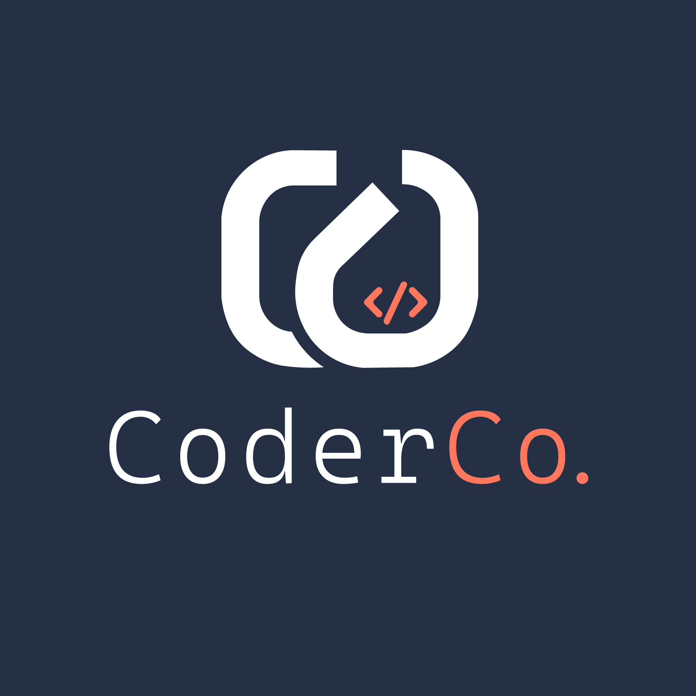

<div align="center">
    
</div>

# URL Shortener - CoderCo ECS Project v2

A URL shortener on AWS. The app is provided. You build everything else.

```
POST /shorten  { "url": "https://example.com/long/path" }  →  { "short": "abc123ef" }
GET /abc123ef  →  302 redirect
GET /healthz   →  { "status": "ok" }
```

## Requirements

- **ECS Fargate** in private subnets, behind an **ALB** with **WAF**
- Tasks must access AWS services without NAT gateways. Figure out how.
- **Database**: DynamoDB or RDS PostgreSQL - you choose, you justify
- **Zero-downtime deployments** with automatic rollback on failure
- **GitHub Actions** CI/CD with no long-lived AWS credentials
- **Terraform** with remote state and modular layout
- **Least-privilege IAM** throughout. No hardcoded credentials.

### App Config

- `TABLE_NAME` env var for DynamoDB
- `DATABASE_URL` env var for PostgreSQL
- Container port: **8080**

## The Deployment Question

You've deployed the service. Now a developer merges a PR and expects their change live within minutes - safely, with zero downtime.

**Design and document the full deployment workflow** in your README. Code merge to live traffic. Cover image builds, task definition updates, traffic shifting, rollback and observability.

## Deliverables

1. Working service with all endpoints functional
2. GitHub Actions workflows (CI + CD)
3. Terraform code for all infrastructure
4. Deployment workflow documentation
5. README with decisions, trade-offs and database justification

## Acceptance Criteria

- No NAT gateways. Tasks still pull images and write logs.
- Zero-downtime deployments with auto-rollback on health check failure.
- Least-privilege IAM for your chosen database.
- No long-lived AWS credentials in CI/CD.
- Remote Terraform state with locking.
- Deployment workflow section present and coherent.
- You can explain every resource. Copy-paste without understanding = resubmission.

## Cost Warning

Tear down when done. ALB + WAF cost money even idle.

[LocalStack](https://docs.localstack.cloud/getting-started/) works for local testing.

Everything else is on you. Commit small. Good luck.
